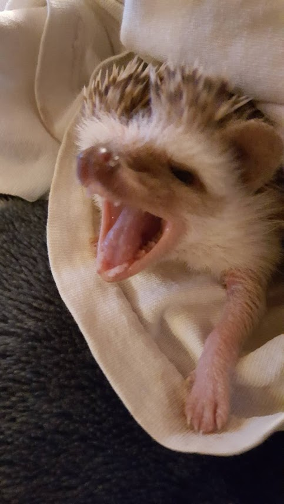

# Arduino Hedgehog Monitor
This is a simple monitor that currently provides temperature and humidity display information on an OLED display.  This was created to monitor cage temperature for our hedgehog, Cybil.  Currently consider this licensed under MIT license for public use unless other licenses should aply.
## TODOs
* Clean up README, licensing, and similar documentation
* Enable AC relay for switching on/off heat lamp
* Enable wifi capability for
  * Web history tracking
  * Phone alerts for over/under temp
  * Phone alerts for system errors (e.g., offline)
* Water level detection?
* Food level detection?
* Activity monitor/tracker (e.g., revolutions per minute & total revolutions per day on wheel)
* Video capture for super-cute moments

